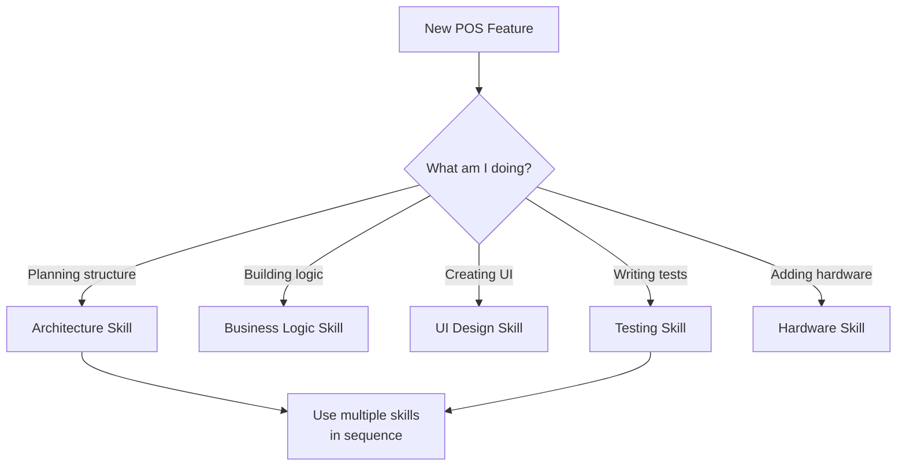

# FlutterPOS Agent Skills Guide

**Last Updated**: March 5, 2026  
**Version**: 1.0

---

## Welcome to Your Expert Flutter & Dart Skills System!

You now have access to **5 specialized agent skills** designed specifically for your FlutterPOS POS Application. These skills are organized by domain expertise to help you build, improve, and maintain your POS app with professional-grade code quality.

---

## 📚 Your Available Skills

### 1. **Flutter Architecture & Refactoring** 
**File**: `SKILL_flutter_architecture.md`

**Expert in**:
- ✅ Three-layer modular architecture (Layer A/B/C pattern)
- ✅ Enforcing the 500-line file size rule
- ✅ Refactoring monolithic code into focused components
- ✅ Service extraction and widget composition
- ✅ Code organization and standards

**When to ask**:
- "Help me refactor this 800-line screen"
- "How should I organize my new feature?"
- "Is my code following the three-layer pattern?"
- "How do I split this large service?"
- "Review my file structure"

**Example Request**:
```
I have a 750-line ProductManagementScreen. 
Can you help me refactor it into the three-layer architecture?
The screen handles: product listing, search, filtering, CSV export, and pricing.
```

---

### 2. **POS Business Logic & Calculations**
**File**: `SKILL_pos_business_logic.md`

**Expert in**:
- ✅ Cart management (add/remove/update items)
- ✅ Price calculations (subtotal, tax, service charge)
- ✅ Discount logic and loyalty points
- ✅ Payment processing and validation
- ✅ Receipt generation
- ✅ Business math accuracy and rounding

**When to ask**:
- "How should I implement discount logic?"
- "My tax calculation isn't working correctly"
- "How do I handle split payments?"
- "What's the best way to structure cart operations?"
- "How do I apply discounts before calculating tax?"

**Example Request**:
```
I need to add a loyalty points redemption feature.
Users should earn 1 point per RM spent,
and can redeem 100 points = RM 1 discount.
How should I structure the service and integrate it into checkout?
```

---

### 3. **POS UI & Responsive Design**
**File**: `SKILL_pos_ui_design.md`

**Expert in**:
- ✅ Responsive grid layouts using LayoutBuilder
- ✅ Touch target optimization (48x48 dp minimum)
- ✅ Adaptive layouts for desktop, tablet, and mobile
- ✅ Text overflow and scrollable components
- ✅ Platform-specific UI patterns
- ✅ Visual hierarchy and spacing

**When to ask**:
- "My grid looks bad on mobile"
- "How do I make my app responsive?"
- "What are good touch target sizes for POS?"
- "How should I layout a restaurant mode screen?"
- "My dialog is getting cut off"

**Example Request**:
```
I'm building a table selection screen for restaurant mode.
I need a grid of tables that:
- Shows 4 columns on desktop
- Shows 2 columns on tablet
- Shows 1 column on mobile
- Has large touch targets for waiters
How should I implement this?
```

---

### 4. **Flutter Testing & Quality Assurance**
**File**: `SKILL_flutter_testing.md`

**Expert in**:
- ✅ Unit testing for business logic (Layer A)
- ✅ Widget testing for components (Layer B)
- ✅ Integration testing for workflows
- ✅ Mocking and test doubles
- ✅ Test coverage and metrics
- ✅ Continuous testing and CI/CD

**When to ask**:
- "How should I test this cart calculation?"
- "How do I write a widget test?"
- "My test coverage is low—where should I focus?"
- "How do I mock a service?"
- "How can I test the complete checkout flow?"

**Example Request**:
```
I have a PaymentProcessingService that:
- Validates payment amount > 0
- Ensures tendered >= amount
- Calculates change
I need comprehensive unit tests covering all cases.
Can you help me write the test suite?
```

---

### 5. **POS Hardware & Device Integration**
**File**: `SKILL_pos_hardware.md`

**Expert in**:
- ✅ Thermal printer integration (58mm/80mm)
- ✅ Receipt formatting and printing
- ✅ Barcode scanner integration
- ✅ Payment terminal/card reader setup
- ✅ Hardware device discovery and connection
- ✅ Hardware error handling and recovery

**When to ask**:
- "How do I connect to a thermal printer?"
- "How should I format receipts?"
- "My barcode scanner isn't working"
- "How do I integrate a card reader?"
- "My printer offline—how should I handle this?"

**Example Request**:
```
I need to integrate Zebra thermal printers for receipt printing.
The app needs to:
- Discover Bluetooth printers
- Print formatted receipts (58mm and 80mm)
- Handle printer errors gracefully
- Support both Android and Windows
```

---

## 🎯 Quick Guide: Choosing the Right Skill

### Refactoring Code?
→ **Flutter Architecture & Refactoring**

### Implementing Calculations, Discounts, or Payments?
→ **POS Business Logic & Calculations**

### Building Screens or Having Layout Problems?
→ **POS UI & Responsive Design**

### Need to Test Code or Improve Coverage?
→ **Flutter Testing & Quality Assurance**

### Integrating Hardware (Printers, Scanners)?
→ **POS Hardware & Device Integration**

---

## 🚀 How to Use These Skills

### Method 1: Direct Requests (Recommended)
Simply ask your coding questions and the agent will automatically select the best skill:

```
"I need to refactor my 650-line checkout screen"
→ Automatically uses Flutter Architecture skill

"My tax calculation isn't working with discounts"
→ Automatically uses POS Business Logic skill

"The product grid looks wrong on tablets"
→ Automatically uses POS UI Design skill
```

### Method 2: Explicit Skill Invocation
You can specify which skill to use:

```
"Using the Flutter Testing skill, help me write tests for my cart service"

"Use the POS Hardware skill to help me integrate the Zebra printer"
```

### Method 3: Code Review
Paste your code and ask for review:

```
"Review this code against the three-layer architecture:
[your code here]
```

---

## 📋 Your Project Context

**Your FlutterPOS Application**:
- **Type**: Multi-flavor Flutter app (POS/KDS/Backend/KeyGen)
- **Platforms**: Windows desktop (primary), Android tablets (secondary)
- **Database**: SQLite (current), Isar (migration planned)
- **Architecture**: Three-layer modular pattern (Layer A/B/C)
- **Tests**: 100+ unit/integration tests
- **Tested Features**: All business logic, main workflows, critical components

**Design Principles You Follow**:
1. ✅ **500-line maximum** per file
2. ✅ **Three-layer separation** (Logic/Widgets/Screens)
3. ✅ **No Flutter imports in services** (Layer A)
4. ✅ **Data via constructor parameters** (Layer B)
5. ✅ **Orchestration in screens** (Layer C)
6. ✅ **Dependency injection** always
7. ✅ **Error handling** with try-catch
8. ✅ **Unit tests** for all logic

---

## 💡 Common Tasks & Which Skill to Use

| Task | Skill(s) |
|------|----------|
| Add new feature to POS | Architecture (design) → Business Logic (implement) → UI (build) → Testing (validate) |
| Fix calculation bug | Business Logic |
| Screen looks bad on phones | UI & Responsive Design |
| Improve test coverage | Testing & QA |
| Add receipt printing | Hardware Integration |
| Refactor large file | Architecture & Refactoring |
| Implement loyalty points | Business Logic + Testing |
| Make responsive grid | UI & Responsive Design |
| Connect barcode scanner | Hardware Integration |
| Debug payment logic | Business Logic + Testing |

---

## 🎓 Learning Resources Within Skills

Each skill file contains:
- **Core concepts** with Dart/Flutter examples
- **Best practices** and anti-patterns
- **Code templates** for your POS app
- **Testing patterns** specific to each domain
- **Common mistakes** and how to avoid them
- **Integration examples** with your project
- **Quick reference** checklists

---

## 🔧 Sample Workflow: Adding Loyalty Points

Here's how you'd use multiple skills for a complete feature:

### Step 1: Architecture Planning
**Use**: Flutter Architecture & Refactoring
```
"Design the three-layer architecture for a new loyalty points feature.
The feature needs:
- Track points earned per transaction
- Allow points redemption (100 points = RM 1)
- Display current points in checkout"
```

### Step 2: Business Logic Implementation
**Use**: POS Business Logic & Calculations
```
"I've designed the architecture. Now help me implement:
- LoyaltyPointsService (Layer A) with earning and redemption logic
- Discount calculation when points are redeemed
- Integration with payment processing"
```

### Step 3: UI Components
**Use**: POS UI & Responsive Design
```
"Now I need to build:
- LoyaltyPointsCard widget to display current points
- PointsRedemptionDialog for redeeming points
- Make responsive for desktop and tablets"
```

### Step 4: Testing
**Use**: Flutter Testing & Quality Assurance
```
"Help me write comprehensive tests:
- Unit tests for LoyaltyPointsService
- Widget tests for the UI components
- Integration test for the complete loyalty workflow"
```

---

## ✨ Tips for Getting Best Results

### 1. **Be Specific**
❌ "Fix my code"  
✅ "I have a 600-line checkout screen mixing UI and business logic. Help me refactor into services and widgets."

### 2. **Provide Context**
❌ "Does this calculation work?"  
✅ "I'm calculating total as: subtotal + (subtotal × taxRate) + (subtotal × serviceChargeRate). Does this apply discount correctly?"

### 3. **Show What You're Working With**
❌ "Help me test this"  
✅ "Here's my PaymentProcessingService [paste code]. Help me write unit tests covering normal payments, insufficient funds, and rounding edge cases."

### 4. **Reference Your Architecture**
All examples use your actual project structure:
- `lib/services/` - Layer A (business logic)
- `lib/widgets/` - Layer B (UI components)
- `lib/screens/` - Layer C (screen orchestration)
- `test/` - Test files following same structure

### 5. **Ask for Best Practices**
Each skill has battle-tested patterns specifically for POS apps—ask for them!

---

## 📞 When to Use Each Skill



---

## 🎯 Your Competitive Advantages

With these skills, you can:

1. **Build faster** - Templates and best practices reduce decision paralysis
2. **Code better** - Proven patterns ensure maintainability
3. **Test thoroughly** - Test templates ensure quality
4. **Avoid mistakes** - Anti-patterns highlighted explicitly
5. **Scale easily** - Three-layer architecture supports growth
6. **Reduce bugs** - Business logic separation and testing catch issues early

---

## 📖 Skill Files Location

All skill files are stored in your project:
- `e:\extropos\.github\SKILL_flutter_architecture.md`
- `e:\extropos\.github\SKILL_pos_business_logic.md`
- `e:\extropos\.github\SKILL_pos_ui_design.md`
- `e:\extropos\.github\SKILL_flutter_testing.md`
- `e:\extropos\.github\SKILL_pos_hardware.md`

You can reference them in conversations by mentioning the skill name!

---

## 🚀 Getting Started

### Right Now:
1. Ask a question about your current work
2. The agent will automatically select the best skill
3. You'll get expert guidance specific to that domain

### Over Time:
- Build features using the skill guidance
- Improve code quality progressively
- Grow your expertise with patterns
- Reference skills when mentoring team members

---

## Examples of Perfect Requests

### Example 1: Refactoring
```
"I have a 750-line RetailPOSScreen that does everything:
- Fetches and displays products
- Manages cart
- Calculates prices and taxes
- Handles checkout flow
How should I refactor this to follow the three-layer pattern?"
```

### Example 2: Bug Fix
```
"My tax calculation is wrong. When I apply a 10% discount,
the tax is still calculated on the original subtotal.
Should tax be calculated before or after discount?
How should I fix the CartCalculationService?"
```

### Example 3: New Feature
```
"I need to implement a 'Buy X Get Y Free' promotional feature.
1. Where should the logic live?
2. How should I calculate the final price?
3. What tests should I write?"
```

### Example 4: UI Problem
```
"My product grid looks great on desktop (4 columns)
but on phones it's still trying to show 4 columns (super squished).
How should I make it responsive using LayoutBuilder?"
```

### Example 5: Hardware
```
"I need to print receipts to a 58mm thermal printer.
The app runs on both Android tablets and Windows desktop.
How should I design the service and handle connection errors?"
```

---

## 🎉 You're All Set!

You now have expert-level guidance across all major areas of POS app development:

✅ **Architecture** - Build organized, maintainable code  
✅ **Business Logic** - Implement accurate calculations  
✅ **UI Design** - Create responsive, usable interfaces  
✅ **Testing** - Ensure quality and reliability  
✅ **Hardware** - Integrate real-world POS devices  

**Start using these skills by asking your first question!**

The agent will automatically route you to the right expertise based on your needs.

---

*Happy coding! Your FlutterPOS app will be even more professional with these skill-guided approaches.* 🚀

