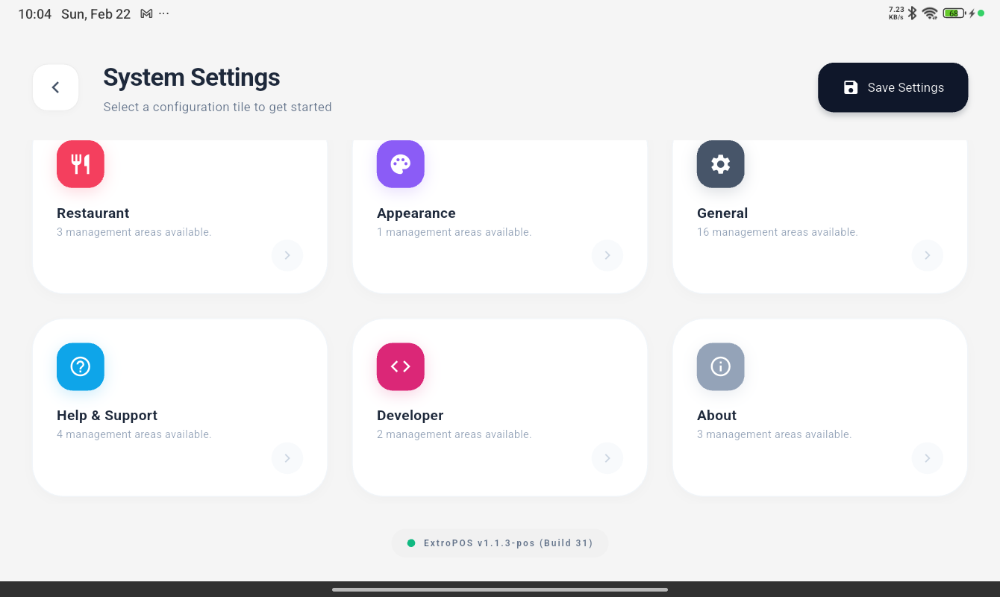
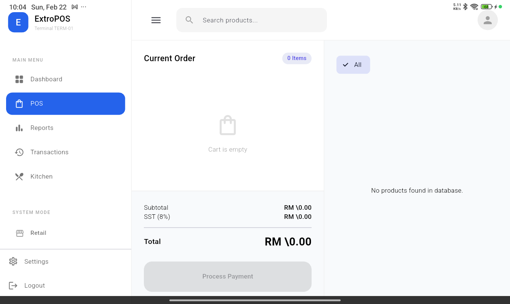

# FlutterPOS v1.1.3+31

> **Responsive POS System for Tablets & Desktop** | Multi-flavor Flutter app with Retail, Cafe, and Restaurant modes

[](https://github.com/SleepyTurtle91/extropos/releases/tag/v1.1.3%2B31)
[](https://github.com/SleepyTurtle91/extropos/actions)
[](https://flutter.dev)

## 📸 Screenshots

### Lock Screen (8-inch Tablet Optimized)


*Fully responsive lock screen with dynamic UI scaling*

### POS Interface


*Dynamic product grid and cart management system*

---

## 🚀 Quick Start

### Download & Install

```bash
# Download APK from GitHub Releases
adb install -r FlutterPOS-v1.1.3-build31.apk
```

### First Login

- **Admin Setup PIN**: `888888`
- **Test PIN**: `1234`

---

## 📋 Features

| Feature | Details |
|---------|---------|
| **Platform** | Android tablets (8"+), Windows desktop |
| **Business Modes** | Retail, Cafe (order numbers), Restaurant (table management) |
| **Responsive UI** | Adaptive layouts for all screen sizes |
| **Database** | SQLite with 20+ tables + cloud sync |
| **Printing** | Thermal receipts (58/80mm), USB/Network/Bluetooth |
| **Multi-Currency** | Configurable currency symbols |
| **Authentication** | PIN-based cashier login |
| **Tax System** | Configurable tax rates per business |
| **Service Charges** | Optional service charge settings |

---

## 🏗️ Architecture

```
main.dart
    ↓
LockScreen (PIN Auth)
    ↓
UnifiedPOSScreen (Mode Router)
    ├→ RetailPOSScreen (Direct checkout)
    ├→ CafePOSScreen (Order numbers)
    └→ TableSelectionScreen → POSOrderScreen (Table service)
```

### Tech Stack

- **Framework**: Flutter 3.19.0+
- **Language**: Dart 3.4.0+
- **Database**: SQLite with full schema
- **Backend**: Appwrite (optional cloud sync)
- **State Management**: Local `setState()` (no external libraries)
- **Printing**: ESCPOS thermal printer support
- **Authentication**: PIN-based with HMAC-SHA256

---

## 📱 Version History

### v1.1.3+31 ⭐ **Latest** (February 22, 2026)

**Highlights:**
- ✅ Responsive lock screen for 8-inch tablets
- ✅ Dynamic UI scaling based on screen size
- ✅ Printer management split-panel redesign
- ✅ Receipt designer with live preview
- ✅ Android ProGuard minification configured

**File Size:** 92.7 MB | **Build Time:** ~8 min

[Download APK](https://github.com/SleepyTurtle91/extropos/releases/download/v1.1.3%2B31/FlutterPOS-v1.1.3-build31.apk)

### Previous Versions

- **v1.1.2+30** - Unified POS screen architecture
- **v1.1.0+28** - Business session & shift management
- **v1.0.27** - Full feature parity

[View All Releases →](https://github.com/SleepyTurtle91/extropos/releases)

---

## 💻 Development

### Prerequisites

```bash
Flutter: 3.19.0+
Dart: 3.4.0+
Android SDK: API 35+
```

### Build APK

```bash
# POS flavor (main app)
flutter build apk --release --flavor posApp --target lib/main.dart

# All flavors
./build_flavors.ps1 all release
```

### Available Flavors

- **posApp** - Main POS application
- **kdsApp** - Kitchen Display System
- **backendApp** - Backend management
- **keygenApp** - License key generator

---

## 🔑 Key Concepts

### BusinessInfo Singleton

All pricing and business settings come from `BusinessInfo.instance`:

```dart
final taxAmount = BusinessInfo.instance.isTaxEnabled 
    ? subtotal * BusinessInfo.instance.taxRate 
    : 0.0;
```

### Responsive Design

All grids must use `LayoutBuilder` with adaptive columns:

```dart
LayoutBuilder(
  builder: (context, constraints) {
    int columns = 4;
    if (constraints.maxWidth < 600) columns = 1;
    else if (constraints.maxWidth < 900) columns = 2;
    else if (constraints.maxWidth < 1200) columns = 3;
    
    return GridView.builder(
      gridDelegate: SliverGridDelegateWithFixedCrossAxisCount(
        crossAxisCount: columns,
      ),
      // ...
    );
  },
)
```

### State Management

No external libraries - use local `setState()`:

```dart
List<CartItem> cartItems = [];

void addToCart(Product product) {
  setState(() {
    final existing = cartItems.firstWhereOrNull(
      (item) => item.product.id == product.id
    );
    if (existing != null) {
      existing.quantity++;
    } else {
      cartItems.add(CartItem(product: product, quantity: 1));
    }
  });
}
```

---

## 📚 Documentation

- **[Release Notes](releases/v1.1.3+31_RELEASE_NOTES.md)** - Detailed changelog
- [GitHub Releases](https://github.com/SleepyTurtle91/extropos/releases) - All versions

---

## 🐛 Issues & Support

- **Report Issues**: [GitHub Issues](https://github.com/SleepyTurtle91/extropos/issues)
- **Discussions**: [GitHub Discussions](https://github.com/SleepyTurtle91/extropos/discussions)

---

## 📄 License

Proprietary - FlutterPOS. All rights reserved.

---

**Updated:** February 22, 2026 | **Version:** 1.1.3+31 | **Author:** SleepyTurtle91
